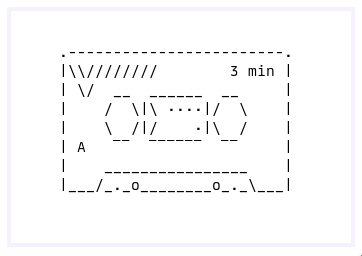

# `tape`
ASCII Art screen recorder. Uses wf-recorder under the hood.



# build and install
```
make
sudo make install
```

# Usage
Open it up and press space or enter to start recording. Same thing to stop
recording.

# Author
Written and maintained by Dakota Walsh.
Up-to-date sources can be found at https://git.sr.ht/~kota/tape/

# License
GNU GPL version 3 or later, see LICENSE.
